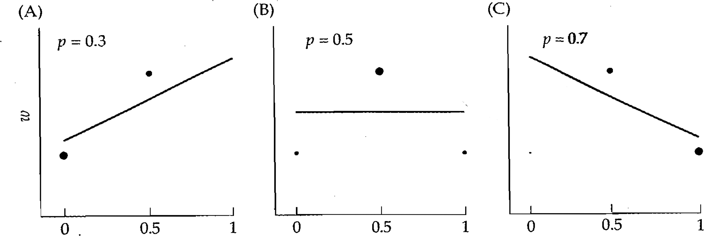
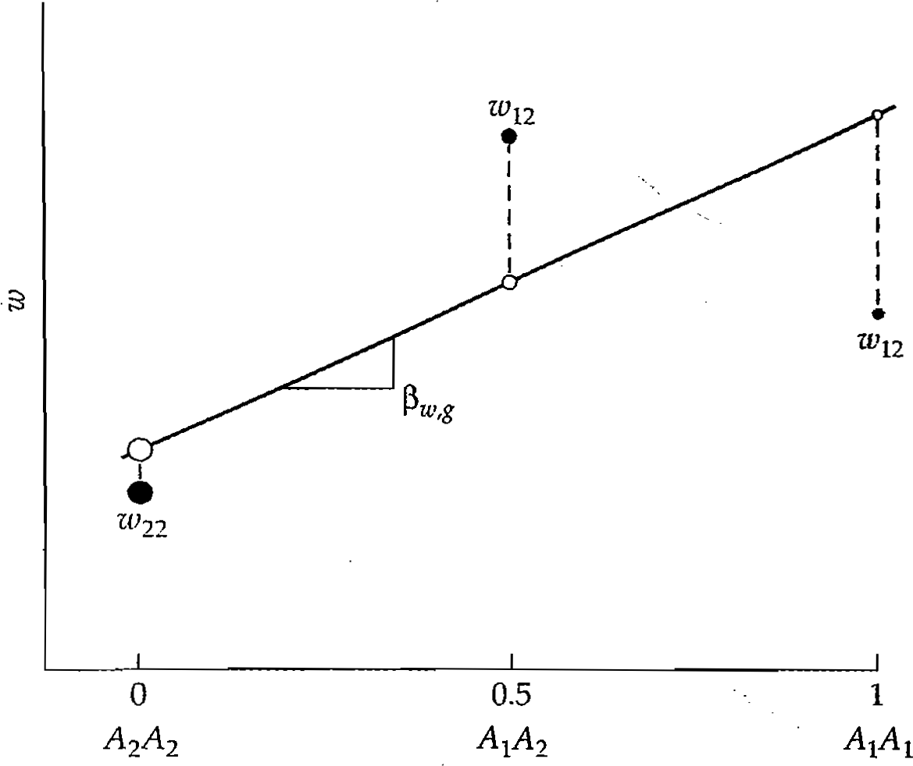
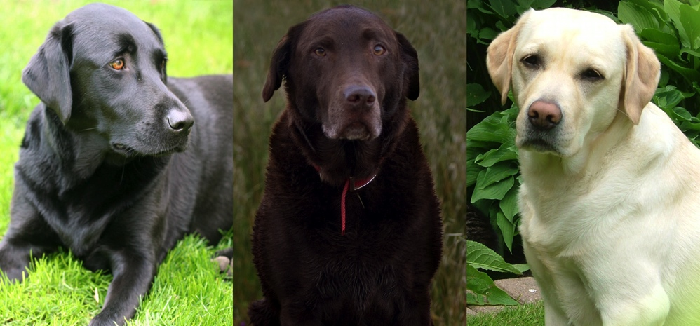
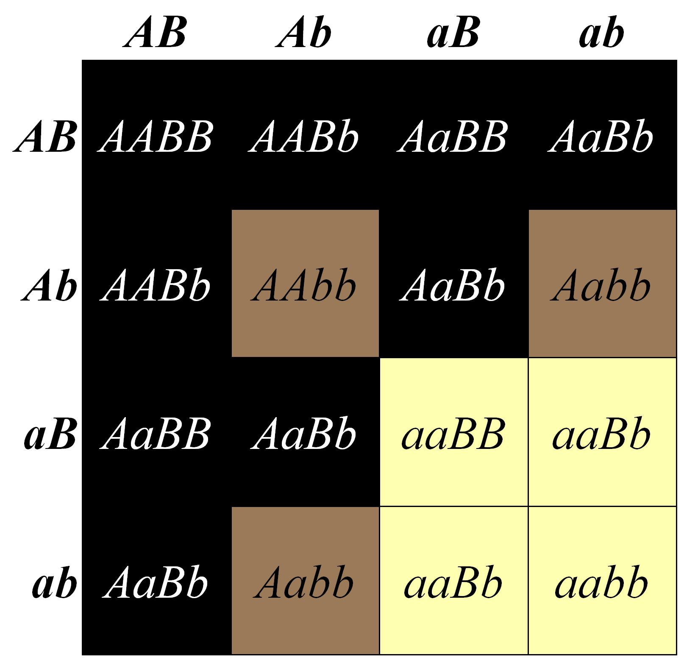
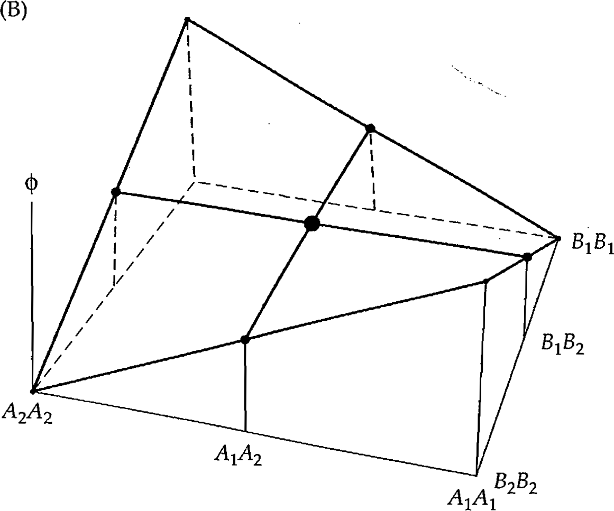
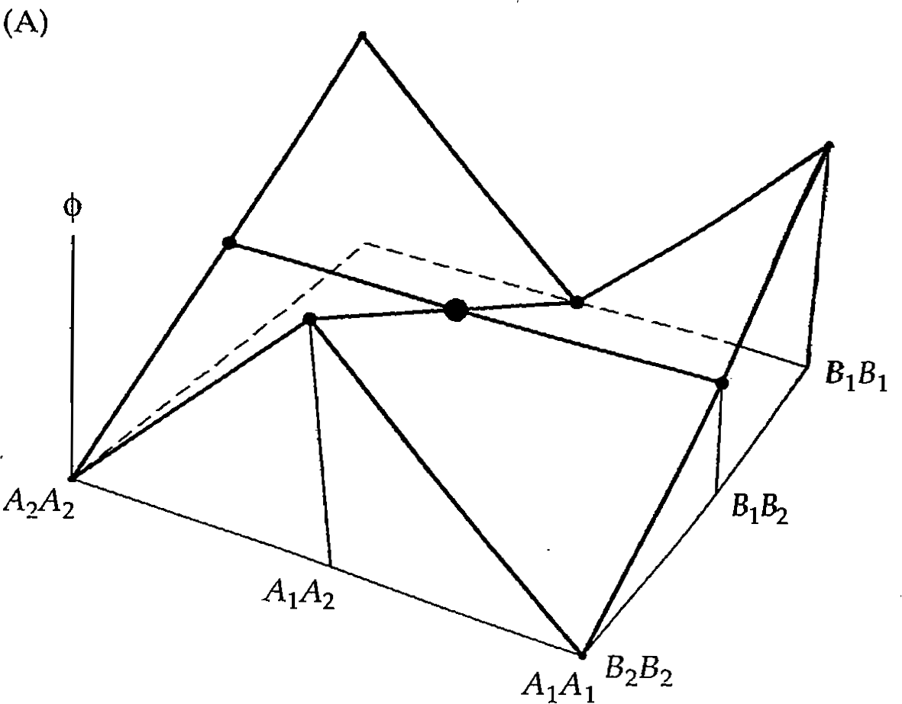
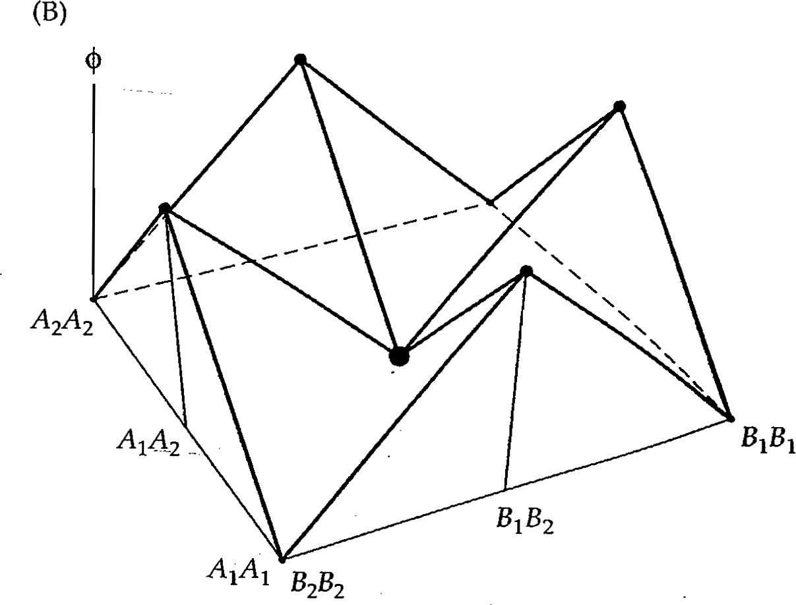

---
title: "Introdução à Genética Quantitativa Evolutiva"
author: "Diogo Melo"
date: diogro@usp.br
logo: ../../logo.png
output:
  ioslides_presentation:
    transitions: faster
    self_contained: true
    widescreen: false
    fig_caption: true
    css: ../02/extra.css
csl: evolution.csl
bibliography: ../ModCurso.bib
---	

<style>
@import url('https://fonts.googleapis.com/css?family=Crimson+Text|Lora:700|Open+Sans+Condensed:300');

slides > slide:not(.nobackground):after {
    font-family: 'Crimson Text', serif;
}

.forceBreak { 
	-webkit-column-break-after: always; 
	break-after: column; 
}

div.footnotes {
  position: absolute;
  bottom: 0;
  margin-left: 50px;
  margin-bottom: 10px;
  width: 80%;
  font-family: 'Crimson Text';
  font-size: 0.6em;
}

img {
    max-height: 560px;
    max-width: 964px;
}
</style>


<script src="https://ajax.googleapis.com/ajax/libs/jquery/3.1.1/jquery.min.js"></script>

<script type="text/x-mathjax-config">
  MathJax.Hub.Config({ TeX: { extensions: ["color.js"] }});
</script>

<style>
.math {
  font-size: huge;
}
</style>

<script>
$(document).ready(function() {
  $('slide:not(.backdrop):not(.title-slide)').append('<div class=\"footnotes\">');
  $('footnote').each(function(index) {
    var oldChars = $(this).html();
    var fnNum    = (index+1).toString().sup();
    var newChars = oldChars + fnNum;
    $(this).html(newChars);
   	var content = fnNum + ': ' + $(this).attr('content') + '<br/>';
	var oldContent = $(this).parents('slide').children('div.footnotes').html();
    var newContent = oldContent + content;
    $(this).parents('slide').children('div.footnotes').html(newContent);
  });
});
</script>

```{r setup, include=FALSE}
knitr::opts_chunk$set(echo = FALSE)
library(knitr)
library(png)
library(jpeg)
knit_hooks$set(plot = function(x, options) {
  paste('<figure><figcaption>', options$fig.cap, '</figcaption></figure>',
        sep = '')
})
```

## Genética quantitativa evolutiva

Mudança no fenótipo = Variação Genética x Seleção

## Genética quantitativa evolutiva

Mudança no fenótipo = Variação Genética x Seleção

- Variação genética -> principal responsável pela similaridade entre pais e filhos

- Se temos *muita* variação genética:
    - Evolução rápida (evolvabilidade alta);
    - Individuos aparentados são mais parecidos entre si que individuos não relacionados
    
## Genética quantitativa evolutiva

Mudança no fenótipo = Variação Genética x Seleção

- Variação genética -> principal responsável pela similaridade entre pais e filhos

- Se temos *pouca* variação genética:
    - evolução lenta ou ausente;
    - individuos aparentados não são mais parecidos entre si que individuos não relacionados

## Variação fenotípica é informativa da variação genética {.centered}

{width=100% }

## Variação fenotípica é informativa da variação genética {.centered}

{width=100% }

## Partição do fenótipo do indivíduo

$$
\Huge z_i = \mu + g_i + e_i
$$


- $\huge z_i$ - fenótipo do indivíduo i

- $\huge \mu$ - média da população

- $\huge g_i$ - valor de genético do indivíduo i

- $\huge e_i$ - valor ambiental do indivíduo i (tudo que não é genético)

<center>
{.centered}
</center>


## Valor genotípico

$$
\Huge g_i
$$

- É a soma de todos os efeitos genotípicos dos loci do indivíduo i que afetam o fenótipo z

## Valor genotípico

$$
\Huge g_i
$$

- É a soma de todos os efeitos genotípicos dos loci do indivíduo i que afetam o fenótipo z

- Para um loci, o valor genotípico tem dois componentes:

$$
\Huge g = a + d
$$

- a é o valor de acasalamento

- d é o desvio de dominância

## Valor de acasalamento

$$
\Huge a_i
$$

- É a soma de todos os efeitos médios dos alelos do indivíduo i que afetam o fenótipo z

- E o que é efeito médio de um alelo?

## Efeito médio do alelo

- Diferença na média do fenótipo dos indivíduos que tem pelo menos uma cópia do alelo (A) e a média da população:

$$
\Huge \alpha_{A} = \overline z_{A\_} - \overline z
$$

## Efeito médio do alelo

- Diferença na média do fenótipo dos indivíduos que tem pelo menos uma cópia do alelo (A) e a média da população:

$$
\Huge \alpha_{A} = \overline z_{A\_} - \overline z
$$

- Sacada Fisheriana: 

<center>
Liga uma medida do alelo (que é herdado) com o fenótipo (que é definido pelo conjunto de genótipos, exclusivo do indivíduo).
</center>

## Uma vez na vida... {.centered}

Vamos calcular o efeito médio de um alelo:

```{r, results="asis", echo = FALSE}
library(xtable)
genotypes = c("AA", "AB", "BB")
phenotypes = c("a", "d", "-a")
frequencies = c("p²", "2pq", "q²")
df = data.frame(genótipos = genotypes, fenótipos = phenotypes, frequência = frequencies)
tab = xtable(df, digits = 2, align = "cccc")
print(tab, type="html")
```

## Genótipos por Fenótipos

```{r, results="asis", echo = FALSE,  warning=FALSE, message=FALSE, fig.height = 5, fig.width = 7}
library(ggplot2)
library(cowplot)
genotypes = c("AA", "AB", "BB")
phenotypes = c(1, 0.5, -1)
df = data.frame(genótipos = factor(genotypes, levels = c("BB", "AB", "AA")), 
                                   fenótipos = phenotypes)
ggplot(df, aes(genótipos, fenótipos)) + geom_point(size = 2) + geom_hline(yintercept = 0) +
  scale_y_continuous(breaks = c(1, 0.5, 0, -1), labels = c("a", "d", "0", "-a")) + 
  annotate("text", y = 0, x = 0.7, label = "Médias dos\n dois homozigotos") + 
  labs(y = "Fenótipos", x = "Número de cópias do A") + theme_cowplot()
```

## Média da população

Lembrando que média é:

$$
\Huge \overline x = \frac{1}{N} \sum_{i = 1}^{N} x_i = \sum_{j=1}^{K} \frac{N_j}{N} x_j = \sum_{j = 1}^{K} f_{x_j} x_j
$$

Podemos calcular a média somando o produdo do fenótipo pela sua frequência:

$$
\Huge \overline z = p^2 a + 2pqd + q^2 (-a)
$$

Então:

$$
\Huge \overline z = (p-q)a + 2pqd
$$

## E o fenótipo médio de quem tem o alelo A

- De novo, vamos multiplicar o fenótipo pela frequência, dado que o indivíduo tem o alelo A. 

- O alelo A é acompanhado de um alelo A com frequência p, 
  e é acompanhado de um alelo B com frequência q.

    - O genótipo AA tem fenótipo a,
    - O genótipo AB tem fenótipo d
    
Então:

$$
\Huge \overline z_A = pa + qd
$$

## Efeito médio do alelo A

$$
\Huge \alpha_A = \overline z_A - \overline z = 
$$

$$
\Huge = (pa + qd) - [(p-q)a + 2pqd]
$$

Simplificando:

$$
\Huge \alpha_A = q[a + (q - p)d] = q \alpha
$$

- Depende das frequência alélicas;
- Portanto depende da população;
- Muda com tempo.

## Efeito médio de substituição

$$
\alpha = a + (q - p) d
$$
```{r, results="asis", echo = FALSE, fig.height = 2.5, fig.width = 4}
genotypes = c("AA", "AB", "BB")
phenotypes = c(1, 0.5, -1)
df = data.frame(genótipos = c(2, 1, 0), 
                fenótipos = phenotypes)
alpha = 1 + (0.6 - 0.4) * 0.5
ggplot(df, aes(genótipos, fenótipos)) + geom_point(size = 2) + geom_hline(yintercept = 0) +
  scale_y_continuous(breaks = c(1, 0.5, 0, -1), 
                     labels = c("a", "d", "0", "-a"), limits = c(-1, 2*0.6*alpha)) + 
  scale_x_continuous(breaks = c(0, 1, 2), labels = c("0",  "0.5", "1")) + labs (x = "Proporção do alelo A", y = "Fenótipo") +
  geom_abline(slope = alpha, intercept = -2*0.4*alpha) + theme_cowplot()
```

## Efeito médio de substituição {.centered}

{width=100%}

## Valor de acasalamento

- Diferença entre a média do valor da prolê do indivíduo com parceiros tomados ao acaso da população.

- Soma do todos os efeitos médios dos alelos que afetam o fenótipo:

$$
\Huge a_i = \sum \alpha_k
$$

## Recapitulando...

O fenótipo do indivíduo é definido como tendo dois componentes:

$$
\Huge z_i = \mu + g_i + e_i
$$

- O componente genético, (g~i~, seu valor genotípico),
    - dado pelos efeitos genéticos dos alelos que o indivíduo possui
    - pode ser dividio em um componente aditivo (a, o valor de acasalamento) e de dominância (d, o desvio de dominância)
    
- O componente ambiental (e~i~, seu valor ambiental),
    - todo o resto
    
## Variância

A partir dessa decomposição, podemos calcular a variância do fenótipo na população:

$$
\Huge Var(z) = Var(g) + Var(e) + Cov(g, e)
$$

Normalmente o genótipo e o ambiente são independentes, então:

$$
\huge Cov(g, e) = 0
$$

## Variância genética total

- A variância genética total pode ser dividida em dois componentes

$$
\Huge Var(g) = Var(a) + Var(d)
$$

- A $\huge Var(a)$ é a variância dos valores de acasalamento, chamada de variância genética aditiva

    - É a responsável pela similaridade em parentes, e portanto a parte da variância genética que importa pra evolução

- A $\huge Var(d)$ é a variância dos desvios de dominância, chamada de variância de dominância

## Interpretação da variância aditiva {.centered}

{width=75%}

## E se as coisas não forem simples?

- Até agora, nós assumimos que os alelos só interagem dentro de locus, num processo chamado dominância.
    - Isso resulta em desvios de dominância.
    
- Mas, nossa vida não é fácil, e os alelos em loci diferentes também podem interagir!
    - A interação entre alelos em loci diferentes chama epistasia.

## Epistasia é muito comum {.centered}

{width=100%}

## Epistasia na cor de labradores {.centered}

{width=70%}


## Regressão reescrita

- O modelo aditivo de um loci pode ser escrito como:

$$
\Huge \phi = \mu + \beta_{\phi, g}g
$$

- $\huge \phi$ - fenótipo
- $\huge \mu$ - média do fenótipo
- $\huge \beta_{\phi, g}$ - coeficiente de regressão do fenótipo no genótipo (efeito médio de substituição)
- $\huge g$ - frequência do alelo A no genótipo $\huge (0, 0.5, 1)$

## Regressão no modelo sem epistasia

- Um locus (A, alelos $\huge A_1$, $\huge A_2$):

$$
\Huge \phi = \mu + \beta_{\phi, g_A}g_A
$$

- Dois loci (A e B, alelos $\huge A_1$, $\huge A_2$ e $\huge B_1$, $\huge B_2$):


$$
\Huge \phi = \mu + \beta_{\phi, g_A}g_A + \beta_{\phi, g_B}g_B
$$

## Fenótipo sem epistasia {.centered}


{width=100%}

## Fenótipo com epistasia {.centered}

{width=75%}

## Regressão com epistasia

- Dois loci sem interação (nem dominância):

$$
\Huge \phi = \mu + \beta_{\phi, g_A}g_A + \beta_{\phi, g_B}g_B
$$

- Dois loci com (dominância e epistasia):

$$
\huge \phi = \mu + \beta_{\phi, g_A}g_A + \beta_{\phi, g_B}g_B + \beta_{\phi, g_A^2}g_A^2 + \beta_{\phi, g_B^2}g_B^2 + \beta_{\phi, g_Ag_B}g_Ag_B
$$

## Fenótipo com epistasia AxA {.centered}

{width=75%}

## Fenótipo com epistasia AxD {.centered}

{width=75%}


## Fenótipo com epistasia DxD {.centered}

{width=75%}

## Epistasia e variância genética

- Os efeitos de interação contribuem para a variância genética.

- Epistasia pode fazer coisas bem malucas. Alguns exemplos:

    - Cheverud, JM, and EJ Routman. 1995. Genetics 139 (3): 1455–61.
    - Cheverud, JM, and EJ Routman. 1996. Evolution 50 (3): 1042.
    - Carlborg, O, L Jacobsson, P Ahgren, P Siegel, and L Andersson. 2006. Nature Genetics 38 (4): 418–20.
    - Le Rouzic, A, and J Álvarez-Castro. 2016. The American Naturalist 188 (6): E134–50.
    
# Intermission